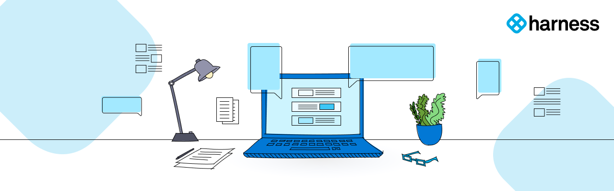
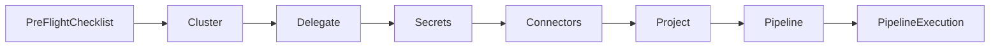

# Harness CD Pipeline Sample

This sample repository shows how to use the [Harness Continuous Delivery Pipeline](https://harness.io/products/continuous-delivery) to deploy an Nginx image to Google Kubernetes Engine using YAML based pipeline creation.

## Getting Started

Use this README to get started with our sample pipeline repository for CD. This guide outlines the basics of getting started with the Harness CD and provides a full YAML to set up your pipeline. This sample doesn’t include configuration options for in-depth steps and configuring the pipeline for other services, but only focuses on Kubernetes.

Setting up and running the pipeline will take about 30 minutes, and by the end, you can run an Nginx image on your cluster with Harness!

## Workflow

The workflow gives instructions on the steps you should take to get started with the sample pipeline. The steps are as follows:

## Layout

| Docs | Description | Link |
| --- | --- | --- |
| PreFlight Checklist | A checklist for all the pre-requisites | [Click Here](docs/PreFlightChecklist.md) |
| Cluster | Steps to set up GKE | [Click Here](docs/clusters) 
| Delegate | Steps to set up the Harness Delegate  | [Click Here](docs/delegates) |
| Secrets | Learn about Secrets and steps to set them up | [Click Here](docs/secrets) |
| Connectors | Steps the to set up Docker and GitHub Connectors  | [Click Here](docs/connectors) |

## Architecture Diagram

## Contributor License Agreement

In order to clarify the intellectual property license granted with Contributions from any person or entity, Harness Inc. ("Harness") must have a Contributor License Agreement ("CLA") on file that has been read, accepted, and followed by each contributor, indicating an agreement to the CLA terms located [here](https://github.com/harness-community/overview/blob/main/Contributor_License_Agreement.md). This license is for your protection as a Contributor as well as the protection of Harness; it does not change your rights to use your own Contributions for any other purpose.

## Code of Conduct

All users and contributors of the Harness community should adhere to the following [Code of Conduct](https://github.com/harness/community/blob/main/CODE_OF_CONDUCT.md)!

## Communication

Refer [Harness Community Communications Guide](https://github.com/harness-community/overview/blob/main/community_communication_guide.rst) to interact with the wider community users/contributors, join slack workgroups to get help/help other users and create topics in [community.harness.io](https://community.harness.io)

## License

MIT License. 

See [COPYING](LICENSE) for more information.