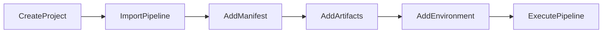

# Getting Started with your Project

> I'm glad you're here. Let me get you started with your brand new project. Follow me...   
`~ Captain Canary `.  

Let's start by [creating a project](docs/project/CreateProject.md)