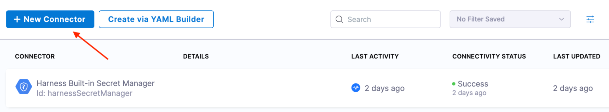
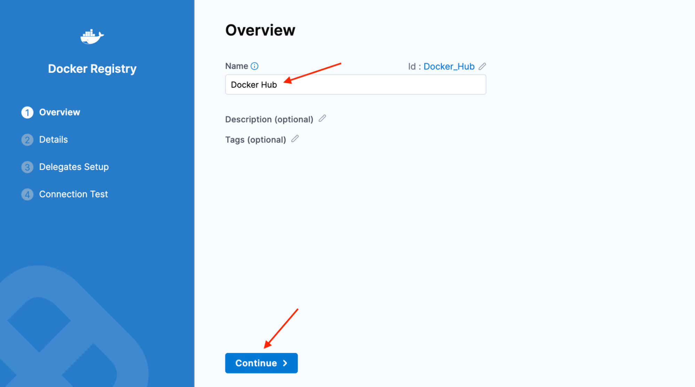
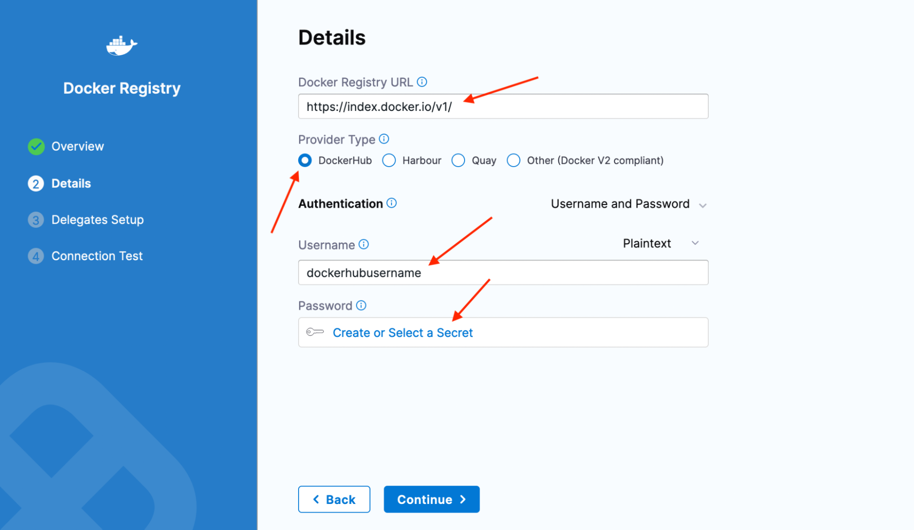
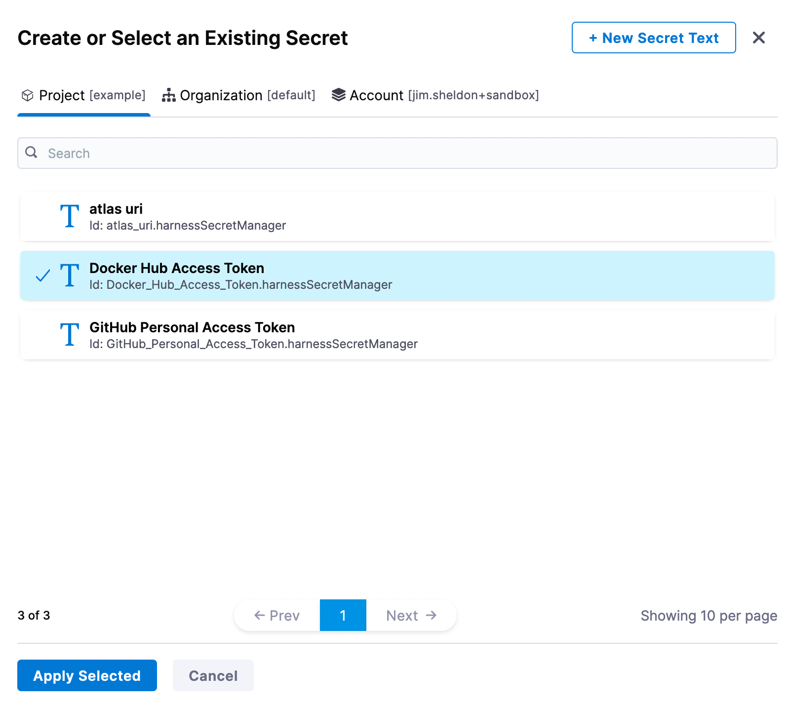
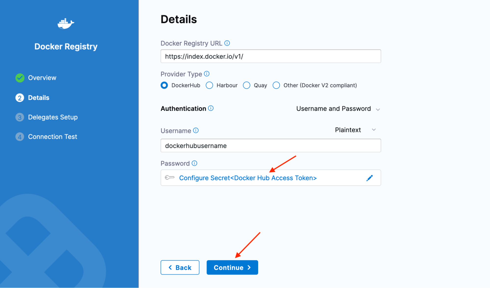
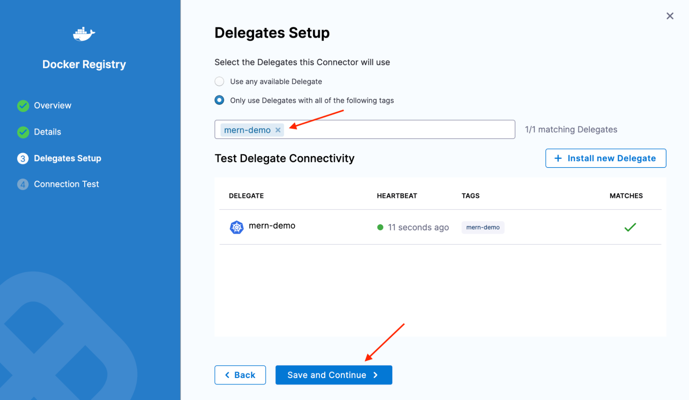
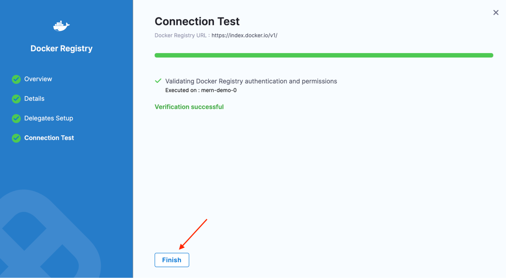

# Docker Hub

Follow these steps to set up a Docker Connector

- Click **New Connector**.

- Enter `“Docker Hub”` in the **Name** field, then click **Continue**.

- Enter `“https://index.docker.io/v1/”` in the **Docker Registry URL** field. That ‘/v1/’ bit is the tricky part. Tripped me up the first time I worked through this, and I’m (dramatic superhero voice) Captain Canary!
- Select **DockerHub** for the **Provider Type**.
- Enter your Docker Hub username in the **Username** field, then click **Create or Select a Secret**.

- Select **Docker Hub Access Token**, then click **Apply Selected**.

- Verify that **Docker Hub Access Token** appears in the **Password** field. Then click **Continue**.

- Select **Only use Delegates with all of the following tags**. Select **mern-demo** from the drop-down menu. Selecting a specific delegate can be useful in select circumstances. Like when you have many delegates or many clusters. This is how you ensure your CI work is happening in the correct cluster.
- Click **Save and Continue**.

- Wait for the test to complete, then click **Finish**.

- At this point, we’ve created the Docker Hub connector. W00t! Feeling good about how to create those connectors? 