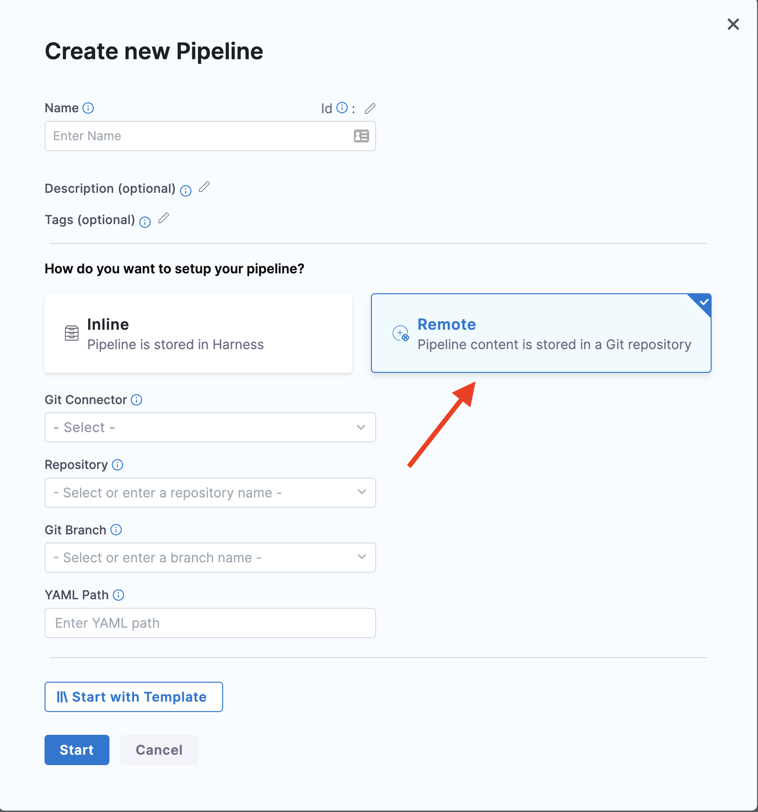

# Import Pipeline

So, we are done with creating a project. Now lets import a pipeline.

## Steps to import a  Pipeline
***

- Select the “**Create a pipeline**” button available at the top left corner of the page and then select “**Remote**”  

- Enter the **name** as “testk8s”, Add the **github connector** “testhelp” which you created on the above step.  
- Under the **repository** section add “YAML-Onboarding-Harness” and select the **git branch** as `main`.  
- Now select **import**